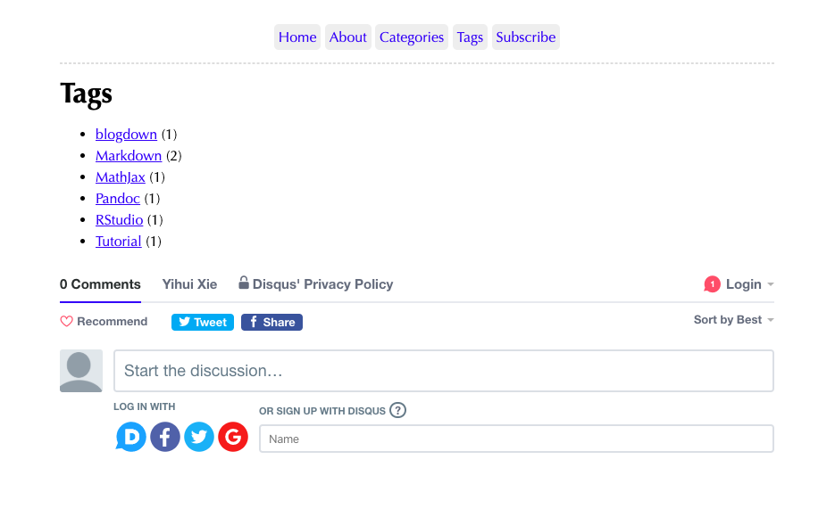

Starting an R-related blog has been on my personal to-do list for quite some time[^years]. This month I decided that I had procrastinated enough, so I went ahead and created this site using [blogdown](https://github.com/rstudio/blogdown), [Hugo](https://gohugo.io/) and the [hugo-xmin](https://github.com/yihui/hugo-xmin) theme. In the process, I learned a couple of things that may be worth sharing:

[^years]: Ever since I heard of blogdown, which means I have basically been putting this off for *years*.

- How to enable comments *and* disable them on selected pages.
- How to set up multilingual mode.

Since this is quite a bit of information, I will split it into two different posts. My advice is biased towards the **hugo-xmin** theme, which is a "boilerplate" theme for those wanting to learn more about customising hugo websites[^looks]. If you want to read more about the theme, I recommend the [templates](https://bookdown.org/yihui/blogdown/templates.html)  chapter of the blogdown book or the demo website at <https://xmin.yihui.org/>.

[^looks]: Or who simply like the way it looks.

## Making changes to the theme

Adding basic features to the hugo-xmin is relatively straight-forward given the [fantastic set of  demos](https://github.com/yihui/hugo-xmin/pulls?q=is%3Apr+is%3Aopen+label%3Afeature) available as pull requests in the theme's Github repo. When implementing these changes to your own website, [the recommended workflow](https://bookdown.org/yihui/blogdown/custom-layouts.html) is to make the changes in the `layouts/` directory under the root directory of your website instead of `layouts/` directory under `themes/hugo-xmin/`. This makes it easier for you to keep track of the changes that you have made that stray from original theme.

```txt {hl_lines = ["14-17"]}
your-website/
├── config.toml
├── ...
├── themes/
│   └── hugo-xmin/
│       ├── ...
│       └── layouts/
│           ├── ...
│           └── partials
│               ├── foot_custom.html
│               ├── footer.html
│               ├── head_custom.html
│               └── header.html
└── layouts
    └── partials
        ├── foot_custom.html
        └── head_custom.html
```


## Enabling Disqus comments

Adding basic features to the hugo-xmin is relatively straight-forward given the [fantastic set of  demos](https://github.com/yihui/hugo-xmin/pulls?q=is%3Apr+is%3Aopen+label%3Afeature) available as pull requests in the theme's Github repo. Pull request [#4](https://github.com/yihui/hugo-xmin/pull/4), for example, explains how to enable Disqus comments in your site.

> *(Straight from the PR)*
>
> Add `{{ template "_internal/disqus.html" . }}` to `layouts/partials/foot_custom.html`:
> 
> ```go {hl_lines = [6]}
> <script src="//yihui.name/js/math-code.js"></script>
> <script async src="//mathjax.rstudio.com/latest/MathJax.js?config=TeX-MML-AM_CHTML"></script>
> 
> <script async src="//yihui.name/js/center-img.js"></script>
> 
> {{ template "_internal/disqus.html" . }}
> ```
> 
> Update the Disqus shortname in `config.toml`:
>
> ```toml {hl_lines = [4]}
> title = "A minimal Hugo website"
> theme = "hugo-xmin"
> googleAnalytics = ""
> disqusShortname = "yihui"
> ignoreFiles = ["\\.Rmd$", "\\.Rmarkdown$", "_files$", "_cache$"]
> footnotereturnlinkcontents = "↩"
> ```

This example calls on one of Hugo's [internal templates](https://gohugo.io/templates/internal/), `_internal/disqus.html`. If you want to further customise the behaviour of Disqus comments, then it may be worthwhile to explore the [source code the template](https://github.com/gohugoio/hugo/blob/master/tpl/tplimpl/embedded/templates/disqus.html).


## Selectively disabling Disqus comments

The above example will enable Disqus comments on all pages, including those where comments may not really be that useful, like in the Categories, Tags or About pages. For example, below is a screenshot of the Tags page of the hugo-xmin Disqus demo. 

<https://deploy-preview-4--hugo-xmin.netlify.com/tags/>


Thankfully, [one of Yihui's comments](https://github.com/yihui/hugo-xmin/pull/4#issuecomment-322301277) on the PRs discussion also explained how to selectively disable Disqus comments on given pages via the YAML metadata.

> In `layouts/partials/foot_custom.html`:
> 
> ```html {hl_lines = ["6-8"]}
> <script src="//yihui.name/js/math-code.js"></script>
> <script async src="//mathjax.rstudio.com/latest/MathJax.js?config=TeX-MML-AM_CHTML"></script>
> 
> <script async src="//yihui.name/js/center-img.js"></script>
> 
> {{ if not .Params.disable_comments }}
> {{ template "_internal/disqus.html" . }}
> {{ end }}
> ```
> 
> In the `.md` or `.Rmd` files of the pages where you want to disable comments:
> 
> ```yaml {hl_lines=[3]}
> ---
> title: Title of post without comments
> disable_comments: true
> ---
> ```

In the above example, the if condition ensures that Disqus comments won't be rendered if the `disable_comments` parameter is set to `true` in a given page.

[Hussain Alsalman recently proposed an alternative approach](https://github.com/yihui/hugo-xmin/pull/39/files) that enables Disqus comments only for pages under the `content/post/` directory. Unlike the previous examples, this approach would require creating a new `single.html` template under `layouts/post/`. You may prefer this implementation if you are creating a website with many types of content directories (e.g. `content/software/`, `content/workshops/`, etc.) and you would rather not have to change the YAML metadata of every file that you create under these directories.

## Extending to utterances :crystal_ball:

I went down the Disqus rabbit-hole before I learned about [utterances](https://utteranc.es/#configuration), which is a lightweight, open-source, and ad-free alternative to Disqus comments. Luckily, extending the above steps to utterances was a breeze.

> Before you get started, you need to [configure your Github repo for utterances](https://utteranc.es/#configuration). You will have to install the app on your website's repo, and create a dedicated issue label for the comments.
> 
> Then, in `layouts/partials/foot_custom.html`:
> ```html {hl_lines = ["6-14"]}
> <script src="//yihui.name/js/math-code.js"></script>
> <script async src="//mathjax.rstudio.com/latest/MathJax.js?config=TeX-MML-AM_CHTML"></script>
> 
> <script async src="//yihui.name/js/center-img.js"></script>
> 
> {{ if not .Params.disable_comments }}
> <script src="https://utteranc.es/client.js"
>         repo="[ENTER REPO HERE]"
>         issue-term="title"
>         theme="github-light"
>         crossorigin="anonymous"
>         async>
> </script>
> {{ end }}
> ```
>
> Again, you disable comments on a page-by-page basis.
> ```yaml {hl_lines=[3]}
> ---
> title: Title of post without comments
> disable_comments: true
> ---
> ```

If you want to learn more about migrating from Disqus to utterances, I highly recommend [Maëlle's blog post](https://masalmon.eu/2019/10/02/disqus/) on the subject. In her post, she explains what motivated her move, how she exported her old comments, and how she added utterances to her theme.

One thing to keep in mind before choosing utterances is that you will be restricting comments to people who either have or are willing to open a Github account. This may therefore not be the best option for blogs intended for a general audience.

## Conclusion

In this post, I went into a lot of detail over a very narrow subject: comments. My intention was to summarise what I learned so that I can refer back to it later, and to hopefully help others who are getting started with Hugo themes. Please let me know if this helped or if anything was unclear! 

In the next post, I will explain how to enable multilingual mode in hugo-xmin.
